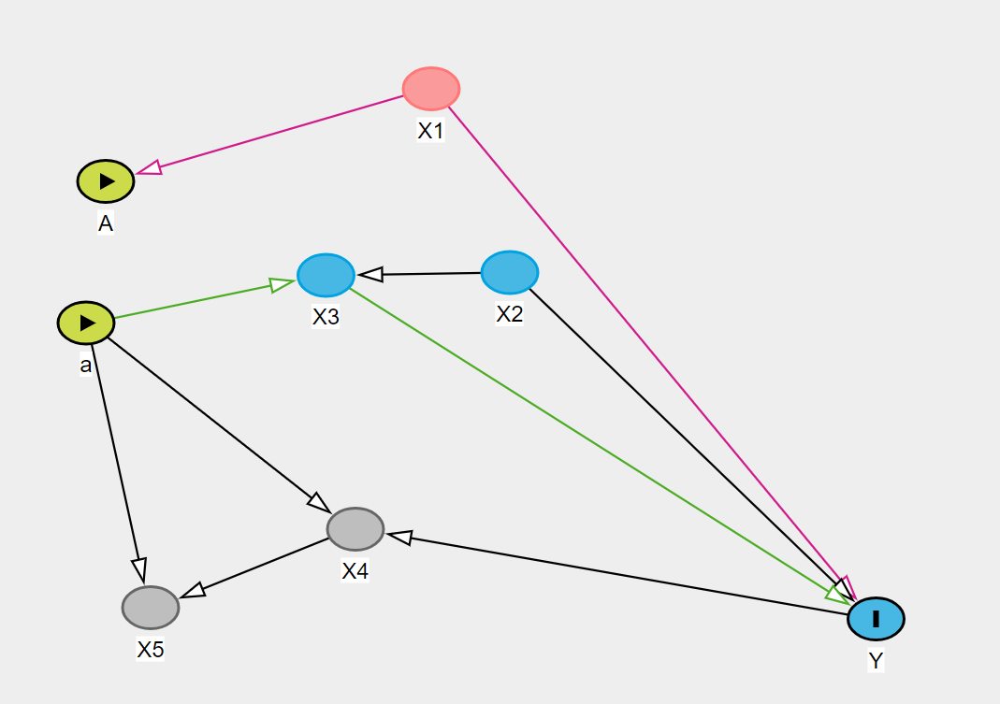
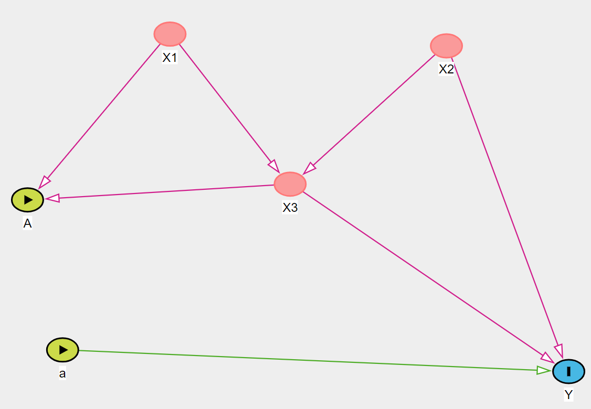

```{r setup, include=FALSE}
knitr::opts_chunk$set(echo = TRUE, fig.align = "center")
pacman::p_load(dplyr
      , ggplot2
      , ggExtra
      , tidyverse
      , MatchIt # PSM
      , tableone # overview data
      , boot # Bootstrap
      )
```


## 1

(a)
```{r, echo=TRUE, warning=FALSE}
# Read data
samp_1k <- read.csv("Sample_Size_1000.csv", header = T)
samp_2k <- read.csv("Sample_Size_2000.csv", header = T)
samp_5k <- read.csv("Sample_Size_5000.csv", header = T)
samp_10k <- read.csv("Sample_Size_10000.csv", header = T)
samp_20k <- read.csv("Sample_Size_20000.csv", header = T)
# Define bootstrap function

q1a <- function(samp){ # a function to process all sizes
  # Split
  set.seed(3)
  n <- nrow(samp)
  a <- sample(n, n/2)
  fold_a <- samp[a, ]
  fold_b <- samp[-a, ]
  # OR
  ate.or <- numeric(1000)
  for(i in 1:1000){
    fold_a.boot <- fold_a[sample(n/2, replace = TRUE), ] # resampling: bootstrap
    model.or_a <- lm(y ~ a + x, fold_a.boot)
    fold_b$pred <- predict(model.or_a, fold_b)
    pred_trt <- subset(fold_b, a==1)
    pred_ctrl <- subset(fold_b, a==0)
    ate.or[i] <- mean(pred_trt$pred) - mean(pred_ctrl$pred)
  }
  return(ate.or)
}

# OR
ate_all <- data.frame(matrix(ncol = 5, nrow = 1000))
colnames(ate_all) <- c("1k", "2k", "5k", "10k", "20k")
ate_all$`1k` <- q1a(samp_1k)
ate_all$`2k` <- q1a(samp_2k)
ate_all$`5k` <- q1a(samp_5k)
ate_all$`10k` <- q1a(samp_10k)
ate_all$`20k` <- q1a(samp_20k)
#CreateTableOne(data = ate_all, smd = T)
q <- unlist(apply(ate_all, 2, 
            function(x) quantile(x, probs = c(0.025, 0.975), na.rm = TRUE)))
tab <- data.frame(mean = apply(ate_all, 2, mean), 
                  quantile_0.025 = q[1,], quantile_0.975 = q[2,])
tab
boxplot(ate_all, main = "Q1.a Boxplot for ATE (OR)")
```

(b)
```{r, echo=TRUE, warning = FALSE}
q1b <- function(samp){ # a function to process all sizes
  # Split
  set.seed(3)
  n <- nrow(samp)
  a <- sample(n, n/2)
  fold_a <- samp[a, ]
  fold_b <- samp[-a, ]
  # OR
  ate.or <- numeric(1000)
  for(i in 1:1000){
    fold_a.boot <- fold_a[sample(n/2, replace = TRUE), ] # resampling: bootstrap
    model.or_b <- lm(y ~ a * x, fold_a.boot)
    fold_b$pred <- predict(model.or_b, fold_b)
    pred_trt <- subset(fold_b, a==1)
    pred_ctrl <- subset(fold_b, a==0)
    ate.or[i] <- mean(pred_trt$pred) - mean(pred_ctrl$pred)
  }
  return(ate.or)
}

# OR
ate_all <- data.frame(matrix(ncol = 5, nrow = 1000))
colnames(ate_all) <- c("1k", "2k", "5k", "10k", "20k")
ate_all$`1k` <- q1b(samp_1k)
ate_all$`2k` <- q1b(samp_2k)
ate_all$`5k` <- q1b(samp_5k)
ate_all$`10k` <- q1b(samp_10k)
ate_all$`20k` <- q1b(samp_20k)
#CreateTableOne(data = ate_all, smd = T)
q <- unlist(apply(ate_all, 2, 
            function(x) quantile(x, probs = c(0.025, 0.975), na.rm = TRUE)))
tab <- data.frame(mean = apply(ate_all, 2, mean), 
                  quantile_0.025 = q[1,], quantile_0.975 = q[2,])
tab
boxplot(ate_all, main = "Q1.b Boxplot for ATE (OR)")
```

(c)
```{r, echo=TRUE, warning=FALSE}
q1c <- function(samp){ 
  # Split
  set.seed(3)
  n <- nrow(samp)
  a <- sample(n, n/2)
  fold_a <- samp[a, ]
  fold_b <- samp[-a, ]
  # OR
  ate.or <- numeric(1000) # bootstrap 1000 times
  for(i in 1:1000){
    fold_a.boot <- fold_a[sample(n/2, replace = TRUE), ] # resampling: bootstrap
    model.or_c_ctrl <- lm(y ~ x + I(x^2) + I(x^3), subset(fold_a.boot, a == 0)) # Control Group
    model.or_c_trt <- lm(y ~ x + I(x^2) + I(x^3), subset(fold_a.boot, a == 1)) # Treatment Group
    pred_trt <- predict(model.or_c_trt, subset(fold_b, a == 1))
    pred_ctrl <- predict(model.or_c_ctrl, subset(fold_b, a == 0))
    ate.or[i] <- mean(pred_trt) - mean(pred_ctrl)
  }
  return(ate.or)
}

# OR
ate_all <- data.frame(matrix(ncol = 5, nrow = 1000))
colnames(ate_all) <- c("1k", "2k", "5k", "10k", "20k")
ate_all$`1k` <- q1c(samp_1k)
ate_all$`2k` <- q1c(samp_2k)
ate_all$`5k` <- q1c(samp_5k)
ate_all$`10k` <- q1c(samp_10k)
ate_all$`20k` <- q1c(samp_20k)
#CreateTableOne(data = ate_all, smd = T)
q <- unlist(apply(ate_all, 2, 
            function(x) quantile(x, probs = c(0.025, 0.975), na.rm = TRUE)))
tab <- data.frame(mean = apply(ate_all, 2, mean), 
                  quantile_0.025 = q[1,], quantile_0.975 = q[2,])
tab
boxplot(ate_all, main = "Q1.c Boxplot for ATE (ORs)")
```
(d)
```{r, echo=TRUE, warning=FALSE}
q1d <- function(samp){ # a function to process all sizes
  # Split
  set.seed(3)
  n <- nrow(samp)
  a <- sample(n, n/2)
  fold_a <- samp[a, ]
  fold_b <- samp[-a, ]
  # OR
  ate.or <- numeric(1000) # bootstrap 1000 times
  for(i in 1:1000){
    fold_a.boot <- fold_a[sample(n/2, replace = TRUE), ] # resampling: bootstrap
    model.or_d_ctrl <- lm(y ~ poly(x, 6), subset(fold_a.boot, a == 0)) # Control Group
    model.or_d_trt <- lm(y ~ poly(x, 6), subset(fold_a.boot, a == 1)) # Treatment Group
    pred_trt <- predict(model.or_d_trt, subset(fold_b, a == 1))
    pred_ctrl <- predict(model.or_d_ctrl, subset(fold_b, a == 0))
    ate.or[i] <- mean(pred_trt) - mean(pred_ctrl)
  }
  return(ate.or)
}

# OR
ate_all <- data.frame(matrix(ncol = 5, nrow = 1000))
colnames(ate_all) <- c("1k", "2k", "5k", "10k", "20k")
ate_all$`1k` <- q1d(samp_1k)
ate_all$`2k` <- q1d(samp_2k)
ate_all$`5k` <- q1d(samp_5k)
ate_all$`10k` <- q1d(samp_10k)
ate_all$`20k` <- q1d(samp_20k)
#CreateTableOne(data = ate_all, smd = T)
q <- unlist(apply(ate_all, 2, 
            function(x) quantile(x, probs = c(0.025, 0.975), na.rm = TRUE)))
tab <- data.frame(mean = apply(ate_all, 2, mean), 
                  quantile_0.025 = q[1,], quantile_0.975 = q[2,])
tab
boxplot(ate_all, main = "Q1.d Boxplot for ATE (ORs)")
```
(e)
```{r, echo=TRUE, warning=FALSE}
q1e <- function(samp){ # a function to process all sizes
  # Split
  set.seed(3)
  n <- nrow(samp)
  a <- sample(n, n/2)
  fold_a <- samp[a, ]
  fold_b <- samp[-a, ]
  # OR
  ate.or <- numeric(1000) # bootstrap 1000 times
  for(i in 1:1000){
    fold_a.boot <- fold_a[sample(n/2, replace = TRUE), ] # resampling: bootstrap
    model.or_e_ctrl <- lm(y ~ poly(x, 6), subset(fold_a.boot, a == 0)) # Control Group
    model.or_e_trt <- lm(y ~ poly(x, 6), subset(fold_a.boot, a == 1)) # Treatment Group
    pred_trt <- predict(model.or_e_trt, subset(fold_b, a == 1))
    pred_ctrl <- predict(model.or_e_ctrl, subset(fold_b, a == 0))
    # Imputation OR
    ate.impor <- numeric(nrow(fold_b))
    ate.impor <- fold_b$a*(fold_b$y-mean(pred_ctrl)) +
        (1-fold_b$a)*(mean(pred_trt)-fold_b$y)
    ate.or[i] <- mean(ate.impor)
  }
  return(ate.or)
}

# OR
ate_all <- data.frame(matrix(ncol = 5, nrow = 1000))
colnames(ate_all) <- c("1k", "2k", "5k", "10k", "20k")
ate_all$`1k` <- q1e(samp_1k)
ate_all$`2k` <- q1e(samp_2k)
ate_all$`5k` <- q1e(samp_5k)
ate_all$`10k` <- q1e(samp_10k)
ate_all$`20k` <- q1e(samp_20k)
#CreateTableOne(data = ate_all, smd = T)
q <- unlist(apply(ate_all, 2, 
            function(x) quantile(x, probs = c(0.025, 0.975), na.rm = TRUE)))
tab <- data.frame(mean = apply(ate_all, 2, mean), 
                  quantile_0.025 = q[1,], quantile_0.975 = q[2,])
tab
boxplot(ate_all, main = "Q1.e Boxplot for ATE (Imputation OR)")
```
(f)
```{r, echo=TRUE, warning=FALSE}
# Propensity score matching (PSM)
# https://www.ncbi.nlm.nih.gov/pmc/articles/PMC8246231/
# tab <- CreateTableOne(vars = c("x", "a", "y"), data = fold_a, 
#                       factorVars = c('a'), strata = 'a', smd = T)
# SMD: standardized mean difference
#print(tab, smd = T, showAllLevels = T, noSpaces = T, printToggle = FALSE)
# tab

# estimate propensity score (PS)
## model <- matchit(formula = a ~ x, data = fold_b, distance = "logit")
## summary(model)
## est.ps <- model$distance
# Propensity Score (PS)
  # model.ps <- glm(a ~ x, family = binomial(link = "logit"), fold_a)
  # fold_a$ps <- predict(model.ps, type = "response")
  # ggplot(fold_a) + 
  #   aes(x = a, y = ps) +
  #   geom_point() +
  #   expand_limits(x = c(0, 1), y = c(0, 1))

q1f <- function(samp){ # a function to process all sizes
  # Split
  set.seed(3)
  n <- nrow(samp)
  a <- sample(n, n/2)
  fold_a <- samp[a, ]
  fold_b <- samp[-a, ]
  ate.ps <- numeric(1000) # bootstrap 1000 times
  # PS
  for(i in 1:1000){
    fold_a.boot <- fold_a[sample(n/2, replace = TRUE), ] # resampling: bootstrap
    # Model to calculate PS
    fit <- glm(a ~ poly(x, 2), family = binomial(link = "logit"), 
                data = fold_a.boot)
    # Calculate PS in fold_b
    fold_b$ps <- predict(fit, fold_b)
    model_f_ctrl <- lm(y ~ ps + a,  subset(fold_b, a == 0)) # Control Group
    model_f_trt <- lm(y ~ ps + a,  subset(fold_b, a == 1)) # Treatment Group
    pred_trt <- predict(model_f_trt, fold_b) # mu(1, pi(x))
    pred_ctrl <- predict(model_f_ctrl, fold_b) # mu(0, pi(x))
    # estimate ate
    ate <- numeric(nrow(fold_b))
    ate <- pred_trt - pred_ctrl
    ate.ps[i] <- mean(ate)
  }
  return(ate.ps)
}
# PS
ate_all <- data.frame(matrix(ncol = 5, nrow = 1000))
colnames(ate_all) <- c("1k", "2k", "5k", "10k", "20k")
ate_all$`1k` <- q1f(samp_1k)
ate_all$`2k` <- q1f(samp_2k)
ate_all$`5k` <- q1f(samp_5k)
ate_all$`10k` <- q1f(samp_10k)
ate_all$`20k` <- q1f(samp_20k)
#CreateTableOne(data = ate_all, smd = T)
q <- unlist(apply(ate_all, 2, 
            function(x) quantile(x, probs = c(0.025, 0.975), na.rm = TRUE)))
tab <- data.frame(mean = apply(ate_all, 2, mean), 
                  quantile_0.025 = q[1,], quantile_0.975 = q[2,])
tab
boxplot(ate_all, main = "Q1.f Boxplot for ATE (Propensity Score)")
```

(g)
```{r, echo=TRUE, warning=FALSE}
q1g <- function(samp){ # a function to process all sizes
  # Split
  set.seed(3)
  n <- nrow(samp)
  a <- sample(n, n/2)
  fold_a <- samp[a, ]
  fold_b <- samp[-a, ]
  ate.ipw <- numeric(1000) # bootstrap 1000 times
  # IPW
  for(i in 1:1000){
    fold_a.boot <- fold_a[sample(n/2, replace = TRUE), ] # resampling: bootstrap
    # Model to calculate PS
    fit <- glm(a ~ poly(x, 1), family = binomial(link = "logit"), 
                data = fold_a.boot)
    # PS in fold_b
    fold_b$ps <- predict(fit, fold_b)
    fold_b$wt <- ifelse(fold_b$a == 1, 1 / fold_b$ps, 1 / (1 - fold_b$ps)) # weight
    # estimate ate
    ate <- numeric(nrow(fold_b))
    ate <- fold_b$wt * fold_b$a * fold_b$y  - fold_b$wt * (1 - fold_b$a) * fold_b$y 
    ate.ipw[i] <- mean(ate)
  }
  return(ate.ipw)
}
# PS
ate_all <- data.frame(matrix(ncol = 5, nrow = 1000))
colnames(ate_all) <- c("1k", "2k", "5k", "10k", "20k")
ate_all$`1k` <- q1g(samp_1k)
ate_all$`2k` <- q1g(samp_2k)
ate_all$`5k` <- q1g(samp_5k)
ate_all$`10k` <- q1g(samp_10k)
ate_all$`20k` <- q1g(samp_20k)
#CreateTableOne(data = ate_all, smd = T)
q <- unlist(apply(ate_all, 2, 
            function(x) quantile(x, probs = c(0.025, 0.975), na.rm = TRUE)))
tab <- data.frame(mean = apply(ate_all, 2, mean), 
                  quantile_0.025 = q[1,], quantile_0.975 = q[2,])
tab
boxplot(ate_all, main = "Q1.g Boxplot for ATE (IPW, degree = 1)")
```

(h)
```{r, echo=TRUE, warning=FALSE}
q1h <- function(samp){ # a function to process all sizes
  # Split
  set.seed(3)
  n <- nrow(samp)
  a <- sample(n, n/2)
  fold_a <- samp[a, ]
  fold_b <- samp[-a, ]
  ate.ipw <- numeric(1000) # bootstrap 1000 times
  # IPW
  for(i in 1:1000){
    fold_a.boot <- fold_a[sample(n/2, replace = TRUE), ] # resampling: bootstrap
    # Model to calculate PS
    fit <- glm(a ~ poly(x, 2), family = binomial(link = "logit"), 
                data = fold_a.boot)
    # PS in fold_b
    fold_b$ps <- predict(fit, fold_b)
    fold_b$wt <- ifelse(fold_b$a == 1, 1 / fold_b$ps, 1 / (1 - fold_b$ps)) # weight
    # estimate ate
    ate <- numeric(nrow(fold_b))
    ate <- fold_b$wt * fold_b$a * fold_b$y  - fold_b$wt * (1 - fold_b$a) * fold_b$y 
    ate.ipw[i] <- mean(ate)
  }
  return(ate.ipw)
}
# PS
ate_all <- data.frame(matrix(ncol = 5, nrow = 1000))
colnames(ate_all) <- c("1k", "2k", "5k", "10k", "20k")
ate_all$`1k` <- q1h(samp_1k)
ate_all$`2k` <- q1h(samp_2k)
ate_all$`5k` <- q1h(samp_5k)
ate_all$`10k` <- q1h(samp_10k)
ate_all$`20k` <- q1h(samp_20k)
#CreateTableOne(data = ate_all, smd = T)
q <- unlist(apply(ate_all, 2, 
            function(x) quantile(x, probs = c(0.025, 0.975), na.rm = TRUE)))
tab <- data.frame(mean = apply(ate_all, 2, mean), 
                  quantile_0.025 = q[1,], quantile_0.975 = q[2,])
tab
boxplot(ate_all, main = "Q1.h Boxplot for ATE (IPW, degree = 2)")
```

## 3

(a)

A <- $X_1$ ->  Y (fork)
a -> $X_3$ ->  Y (chain)
a -> $X_3$ <- $X_2$ ->  Y (V shape; fork)
a -> $X_4$ <-  Y (V shape)
a -> $X_5$ <- $X_4$ <- Y (V shape; chain)

(b)

$\{\emptyset\}$: A -> $X_3$ <- $X_2$ ->  Y ( $X_3 \notin \{\emptyset\}$ ) ; A -> $X_4$ <-  Y ($X_4 \notin \{\emptyset\}$) ; A -> $X_5$ <- $X_4$ <- Y ( $X_5 \notin \{\emptyset\}$ )

$\{X_1\}$: A <- $X_1$ ->  Y ( $X_1 \in \{X_1\}$ ) ; a -> $X_4$ <-  Y ( $X_4 \notin \{X_1\}$ ); a -> $X_3$ <- $X_2$ ->  Y ( $X_3 \notin \{X_1\}$ ); a -> $X_5$ <- $X_4$ <- Y ( $X_5 \notin \{X_1\}$ )

$\{X_2\}$: a -> $X_3$ <- $X_2$ ->  Y ( $X_2 \in \{X_2\}$ ) ; a -> $X_4$ <-  Y ( $X_4 \notin \{X_2\}$ , $X_4$ not descendant to $X_2$); a -> $X_5$ <- $X_4$ <- Y ( $X_5 \notin \{X_2\}$ , $X_5$ not descendant to $X_2$ )

$\{X_3\}$: a -> $X_3$ ->  Y ; a -> $X_4$ <-  Y; a -> $X_5$ <- $X_4$ <- Y

$\{X_4\}$: a -> $X_3$ <- $X_2$ ->  Y 

$\{X_5\}$: a -> $X_3$ <- $X_2$ ->  Y ; a -> $X_4$ <-  Y

$\{X_1, X_2\}$: A <- $X_1$ ->  Y ; a -> $X_3$ <- $X_2$ ->  Y; a -> $X_4$ <-  Y; a -> $X_5$ <- $X_4$ <- Y

$\{X_1, X_3\}$: A <- $X_1$ ->  Y ; a -> $X_4$ <-  Y; a -> $X_5$ <- $X_4$ <- Y

$\{X_1, X_4\}$: A <- $X_1$ ->  Y ; a -> $X_3$ <- $X_2$ -> Y ; a -> $X_5$ <- $X_4$ <- Y (chain)

$\{X_1, X_5\}$: A <- $X_1$ ->  Y ; a -> $X_3$ <- $X_2$ -> Y ; a -> $X_4$ <-  Y

$\{X_2, X_3\}$: a -> $X_3$ ->  Y ; a -> $X_3$ <- $X_2$ ->  Y ; a -> $X_4$ <-  Y; a -> $X_5$ <- $X_4$ <- Y

$\{X_2, X_4\}$: a -> $X_3$ <- $X_2$ ->  Y (fork) ; a -> $X_5$ <- $X_4$ <- Y (chain)

$\{X_2, X_5\}$: a -> $X_3$ <- $X_2$ ->  Y (fork) ; a -> $X_4$ <-  Y (V shape)

$\{X_3, X_4\}$: a -> $X_3$ ->  Y ; a -> $X_5$ <- $X_4$ <- Y (chain)

$\{X_3, X_5\}$: a -> $X_3$ ->  Y ; a -> $X_4$ <-  Y (V shape)

$\{X_4, X_5\}$: a -> $X_3$ <- $X_2$ ->  Y ; a -> $X_5$ <- $X_4$ <- Y (chain)

$\{X_1, X_2, X_3\}$: A <- $X_1$ ->  Y ; a -> $X_3$ ->  Y ; a -> $X_3$ <- $X_2$ ->  Y ; a -> $X_4$ <-  Y ; a -> $X_5$ <- $X_4$ <- Y 

$\{X_1, X_2, X_4\}$: A <- $X_1$ -> Y ; a -> $X_3$ <- $X_2$ -> Y ; a -> $X_5$ <- $X_4$ <- Y

$\{X_1, X_2, X_5\}$: A <- $X_1$ -> Y ; a -> $X_3$ <- $X_2$ -> Y ; a -> $X_4$ <-  Y

$\{X_2, X_3, X_4\}$: a -> $X_3$ <- $X_2$ -> Y

$\{X_2, X_3, X_5\}$: a -> $X_3$ <- $X_2$ -> Y (fork) ; a -> $X_4$ <-  Y

$\{X_3, X_4, X_5\}$: a -> $X_5$ <- $X_4$ <- Y (chain)

$\{X_1, X_2, X_3, X_4\}$: A <- $X_1$ -> Y ; a -> $X_3$ <- $X_2$ -> Y ; a -> $X_3$ ->  Y ; a -> $X_5$ <- $X_4$ <- Y

$\{X_1, X_2, X_3, X_5\}$: A <- $X_1$ -> Y ; a -> $X_3$ <- $X_2$ -> Y ; a -> $X_3$ ->  Y ; a -> $X_4$ <-  Y

$\{X_1, X_2, X_4, X_5\}$: A <- $X_1$ -> Y ; a -> $X_3$ <- $X_2$ -> Y ; a -> $X_5$ <- $X_4$ <- Y (chain)

$\{X_1, X_3, X_4, X_5\}$: A <- $X_1$ -> Y ; a -> $X_5$ <- $X_4$ <- Y (chain)

$\{X_2, X_3, X_4, X_5\}$: a -> $X_5$ <- $X_4$ <- Y (chain)

$\{X_1, X_2, X_3, X_4, X_5\}$: A <- $X_1$ -> Y ; a -> $X_3$ <- $X_2$ -> Y ; a -> $X_3$ ->  Y ; a -> $X_5$ <- $X_4$ <- Y

## 4

(a)

$\{\emptyset\}$, $\{X_1\}$, $\{X_2\}$, $\{X_1, X_3\}$, $\{X_1, X_2\}$, $\{X_1, X_2, X_3\}$

if $\{X_1\}$, $\{X_2\}$ unobserved: $\{\emptyset\}$

(b)



$\{X_1, X_2\}$

if $\{X_1\}$, $\{X_2\}$ unobserved: $\{\emptyset\}$